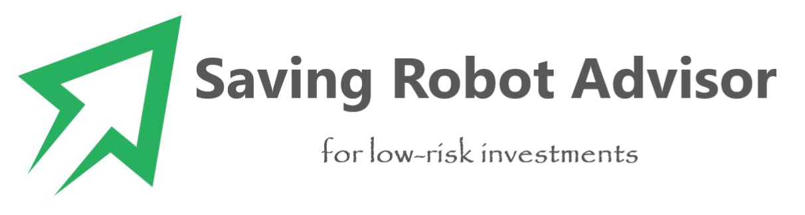
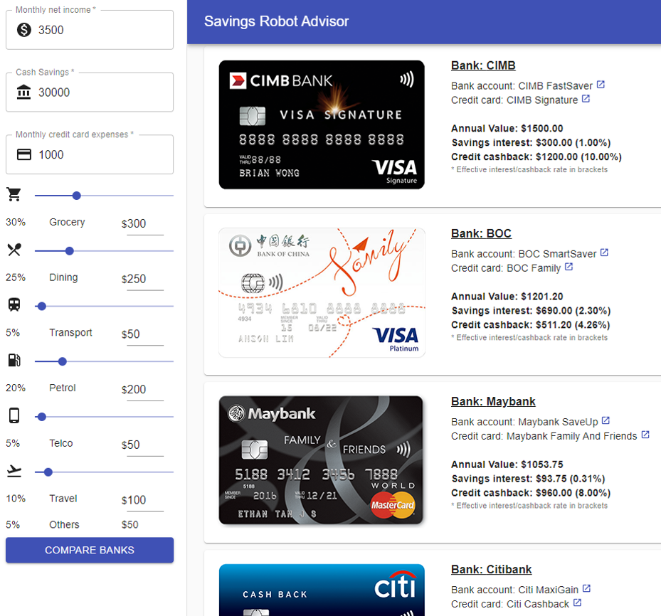


## SECTION 1 : PROJECT TITLE
## Savings Robot Advisor (SRA)

---

## SECTION 2 : EXECUTIVE SUMMARY / PAPER ABSTRACT

The Saving Robot Advisor is a minimum viable product. It is mainly focused on saving interests as well as credit cash back.

To bear "easy for everyone to access" in mind, the Saving Robot Advisor requires no username or password to start with. Main functional page will be directly shown to users. The designers keep the application easy to access and direct in outcome.

Research shows over 70 per cent of Singapore’s emerging affluent used savings accounts. In other words, majority of the population who with monthly income between S$5,000 and S$10,600 are using saving accounts. Then how to choose a proper account will not be a small issue anymore. This is where the team starts to think about the project’s direction.

Besides saving interests, the team notice that credit cards’ cash back is another part which maximize daily earn. There are hundreds of credit cards on the market. To choose the ones suit different life styles is another headache. Thus the second main function kicks in and combined with saving account choosing.

The Saving Robot Advisor is focused on absolute monetary value which is saving interests plus credit rebate. There will be no points or miles in the scope. Bank wise, all banks on the market are taken into consideration. Users won't miss anyone.

The system has identified the highest interest savings account and cash back credit card from each bank. Based on that, 8 savings accounts and credit cards pairs are shortlisted through primary and secondary research.

---

## SECTION 3 : CREDITS / PROJECT CONTRIBUTION

| Official Full Name | Student ID | Work Items |
| ------------ | --------------- | ----- | 
| Ng Ziming Vincent | A0213488Y | System architecture, Market Research, Frontend Web-UI |
| Zhou Zhe | A0213542R | Market Research, Knowledge Acquisition, Backend REST API |
| Li Yian | A0101907N | Data Mining, Knowledge Discovery |
| Dong Xiaoguang | A0066960X | Project Video, Project Documentation |

---

## SECTION 4 : VIDEO OF SYSTEM MODELLING & USE CASE DEMO

---

## SECTION 5 : USER GUIDE

`Refer to appendix <Installation & User Guide> in project report at Github Folder: ProjectReport`

### [ 1 ] To run the system using iss-vm

> download pre-built virtual machine from http://bit.ly/iss-vm

> start iss-vm

> open new terminal window in iss-vm

> mkdir SRA

#### Install latest Nodejs:

> curl -sL https://deb.nodesource.com/setup_14.x | sudo -E bash -

> sudo apt-get install -y nodejs

#### Install lightweight static web server:

> sudo npm install -g serve

#### Backend setup and deployment:

> cd SRA

> wget https://github.com/loxyzhou/IRS-MRS-2020-01-18-IS02PT-GRP-4M-SavingRobotAdvisor/raw/master/deployment/SRA-backend.zip

> unzip SRA-backend.zip

> ./publish/SavingRobotAdvisorApi

#### Frontend setup and deployment:

> Open another new terminal window

> cd SRA

> wget https://github.com/loxyzhou/IRS-MRS-2020-01-18-IS02PT-GRP-4M-SavingRobotAdvisor/raw/master/deployment/SRA-frontend.zip

> unzip SRA-frontend.zip

> serve -s build -l 3000

> **Go to URL using web browser** http://localhost:3000 or http://127.0.0.1:3000

### [ 2 ] To access the online system:

> **Go to URL using web browser** http://gvinto.synology.me:3000/

---
## SECTION 6 : PROJECT REPORT / PAPER

`Refer to project report at Github Folder: ProjectReport`

---
## SECTION 7 : MISCELLANEOUS

`Refer to Github Folder: Miscellaneous`

### wealth-expectancy-report-2019.pdf
* Insights derived on market demand for Savings Accounts as an investment vehicle

### Savings and CC products.xlsx
* Market Research, which were subsequently implemented into knowledge base

---

